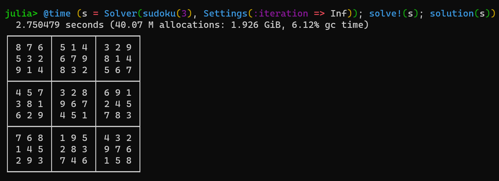

```@meta
CurrentModule = LocalSearchSolvers
```

# Constraint-Based Local Search

LocalSearchSolvers.jl proposes sets of technical components of Constraint-Based Local Search (CBLS) solvers and combine them in various ways.

<!-- TODO: what is a CBLS solver etc. -->



## Dependencies

This package makes use of several dependencies from the JuliaConstraints GitHub org:
- `ConstraintDomains.jl`: a domains back-end package for all JuliaConstraints front packages
- `Constraints.jl`: a constraints back-end package for all JuliaConstraints front packages
- `CompositionalNetworks.jl`: a module to learn error functions automatically given a *concept*
- `Garamon.jl` (incoming): geometrical constraints

## Features

- [ ] Resolution of problems
  - [x] SATisfaction
  - [x] OPTimisation (single-objective)
  - [ ] OPTimisation (multiple-objective)
- [ ] Domains
  - [x] Discrete domains (any type of numbers)
  - [ ] Continuous domains
  - [ ] Arbitrary Objects such as physical ones
- [ ] Parallelization
  - [ ] Multithreading
  - [ ] Distributed
- [ ] Solvers
  - [x] GHOST (the C++ lib)
  - [ ] Adaptive Search
- [ ] Domain Specific Languages (DSL)
  - [x] Straight Julia
  - [ ] JuMP*ish*
  - [ ] MiniZinc
- [ ] Others
  - [ ] Dynamic problems
  - [ ] Neighbourhoud selection
  - [ ] Variable selection
  - [ ] Mixed-solvers/methods with learning 